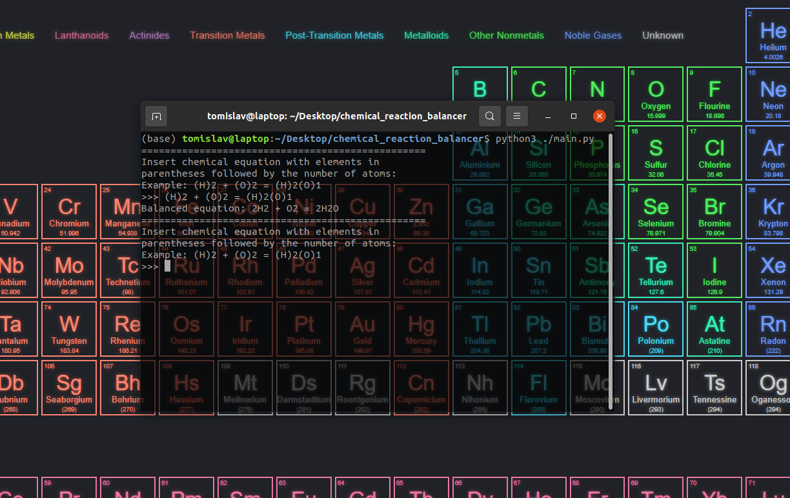

# Chemical Equation Balancer
This is a python program that outputs the balanced chemical equation of an unbalanced equation provided by the user through the terminal.

## Software/Tools Required
- Visual Studio Code or any IDE/Code Editor
- Python3

## How Does This Program Work?
- After cloning this repository and installing the required tools/software, you will run the command: `python3 ./main.py`
- There is an example provided in the terminal to give you an idea of the format. 
- Then, the program will prompt you to enter an unbalanced chemical equation. 
- Finally, the output provided will be the balanced chemical equation.

## Screenshot/Illustration of Program

